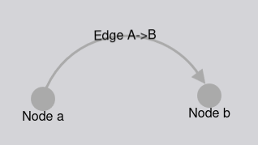
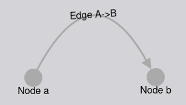
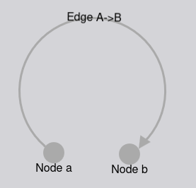
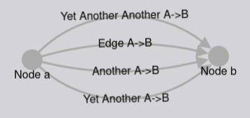

# New curve type: circle arcs
_(Even though it wasn't mentioned there explicitly, this is another PR spinning
out from https://github.com/cytoscape/cytoscape.js/discussions/3145)_

**Description of new feature**

_What should the new feature do? For visual features, include an image/mockup of the expected output._

Currently, Cytoscape.js only supports quadratic Bezier curves (or several of
them combined as a spline) as a generic way to create curved edges. Circle arcs
would be a second "curved" shape that ends up being very distinct from Bezier
curves in many respects. 

Compare this to the equivalent Bezier curve:

They also allow for "larger" arcs than Bezier curves, with very little effort:

I would propose a new `curve-shape: arc` style. Its shape is defined by a
single `control-point-distance` value that would measure the distance of the
middle of the arc to the line connecting the two nodes (very similar to how 
`control-point-distance` works for Bezier curves). That is to say, we could
reuse the same style property and minimize the number of user-facing changes.

**Motivation for new feature**

_Describe your use case for this new feature._

While it's possible (but difficult) to emulate circle arcs by stringing together
several bezier curves, it becomes painful (and expensive) to make sure those
curves retain their shape when nodes are moved around, to make sure the 
approximation looks passable in all possible configurations, etc...

In many cases, circular arcs are more desirable, stylistically speaking, and 
they are more intuitive to the average user than bezier curves.

**Edge cases to consider**

It feels _very_ natural to allow both "bundled" and "unbundled" arcs, similar to
what is currently possible for Bezier curves. If this feature is considered
interesting enough to pursue, it would make sense to scope the initial PR to
"unbundled" arcs, and add "bundled" arcs as a follow-up PR.

This leaves us with a couple of options:
1. We need to add unbundled arcs under an `unbundled-arc` style, when there
   isn't a regular ("bundled") `arc` type available yet.
2. Break the naming pattern established with `bezier`/`unbundled-bezier` and 
   instead opt for `arc` and `bundled-arc`.
3. Do the work for both bundled and unbundled at once (looking at the code for
   bundled/unbundled bezier curves, and based on an initial prototype I did, 
   this would be fairly little additional code)

I would lean towards option number 3, but happy to leave that decision on the
table for now.
